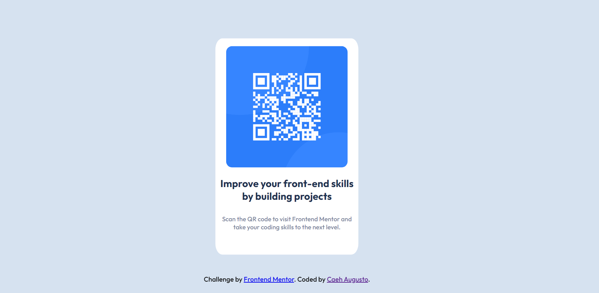

# Frontend Mentor - QR code component solution

This is a solution to the [QR code component challenge on Frontend Mentor](https://www.frontendmentor.io/challenges/qr-code-component-iux_sIO_H). Frontend Mentor challenges help you improve your coding skills by building realistic projects. 

## Table of contents

- [Overview](#overview)
  - [Screenshot](#screenshot)
  - [Links](#links)
- [My process](#my-process)
  - [Built with](#built-with)
  - [What I learned](#what-i-learned)
  - [Useful resources](#useful-resources)
- [Author](#author)

## Overview

### Screenshot

### Links

- Solution URL: [Add solution URL here](https://your-solution-url.com)

## My process

Started with analyzing how many layers I'd need in order to properly fit the content, images and texts. Then i proceeded to creating the sections, divs and providing all with ids in order to facilitate styling in CSS.

### Built with

- Semantic HTML5 markup
- CSS custom properties

### What I learned

I learned about inset in CSS.

### Continued development

I need to continue focus on learning CSS regarding positions, mobile-first coding and best practices of clean code. In HTML, my main focus is going to be how to create the best semantic.

### Useful resources

- [CSS Positions](https://developer.mozilla.org/en-US/docs/Web/CSS/position) - This helped me for getting Sections and Div positions right.
- [Inset shorthand](https://developer.mozilla.org/en-US/docs/Web/CSS/inset) - This helped me solve an issue with Footer position.

## Author

- Website - [My GitHub](https://github.com/altrancaeh)
- Frontend Mentor - [@altrancaeh](https://www.frontendmentor.io/profile/altrancaeh)
- Linkedin - [Caeh Augusto](https://www.linkedin.com/in/caeh-augusto-altran-703980160/)

